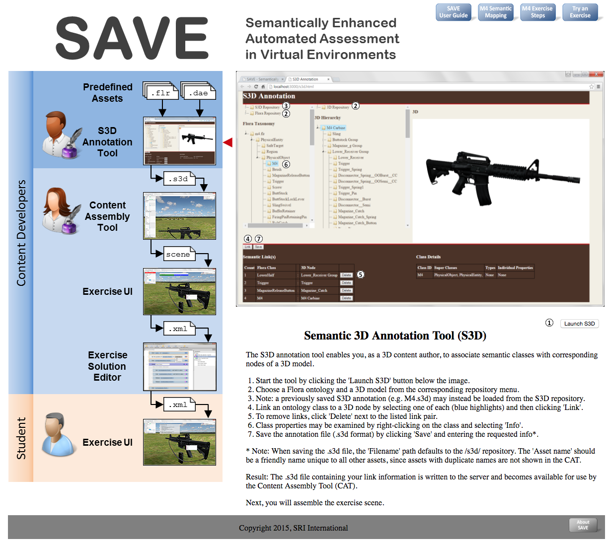

# SAVE Web Applications

Semantically Enhanced Automated Assessment in Virtual Environments

## Installation

```
$ git clone https://github.com/SRI-SAVE/vwf.git
$ npm install
```

NOTE: On Mac OS X, please make sure you have Xcode Command Line Tools installed prior to executing the script below (https://developer.apple.com/xcode/).

```
$ node node-server.js -a public
```

The SAVE application is now up and running at [http://localhost:3000](http://localhost:3000).

A brief Description of each of the "vwf" applications is below. THe default page puctured below has more details and direct access to each application.

<a href="SAVE.png"></a>

## SAVE Applications Descriptions
#### S3D Annotation
Loads and edits s3d files

## CAT (Content Assembly Tool)
Loads s3d files into a scene for assembly, positioning, and default settings

## EUI (Exercise User Interface) "Instructor"
Load the CAT scene and perform instructor specified actions creating the "gold" standard

## EUI (Exercise User Interface) "Student"
Load the CAT scene and perform student specified actions creating and examine the your "student" assessment.

## Reference
### published/clearing
Example clearing exercise that is published and ready for student "operation" and assessment.

### published/disassembly
Example disassembly exercise that is published and ready for student "operation" and assessment.

### dot behave (.behave) subfolder
The SAVE backend will create this directory inside any published exercise from the CAT tool. This folder and files are necessary for operation and contain application functions common for all published CAT scenes. There are master copies SAVE/behavior. See [Development](#Development) for a descriptions of each of the files and the functions within.

### cat.json.js
Set the baseServerAddress to the SAVE backend. This file is required and needed for proper CAT operation.
NOTE: For development and testing there is a provided nodejs backend server echoandtestingtxrx.js, see [Development](#Development)
```
var __CAT = {
    "baseServerAddress": "http://localhost:3001/CAT"
};
```

### eui.json.js
Set the baseServerAddress to the SAVE backend. This file is required and needed for proper EUI operation.
NOTE: For development and testing there is a provided nodejs backend server echoandtestingtxrx.js, see [Development](#Development)
```
var __EUI = {
    "baseServerAddress": "http://localhost:3001/PutExercise"
};
```

## Development
### echoandtestingtxrx.js
Located in the scripts folder. It is used for simulating the SAVE backend locally.
```
$ node echoandtestingtxrx

http://localhost:3001
```
### Enhancing echoandtestingtxrx
```
route.get()
route.put()
```

## dot behave (.behave) subfolder contents and technical description of each
### backendtxrx.sav.yaml
Communication functions for vwf nodes
```
obj()
query()
activity()
post()
```

### begin.save.yaml
Initialize the SAVE application
```
processSaveDotJson
```

### cameranav.save.yaml
Camera orbit function, vwf orbit was broken, this is a replacement

### initNode3.save.yaml
Initialize a SAVE node3

### instance.save.yaml
Instance a SAVE S3D mapped 3D asset into the vwf
